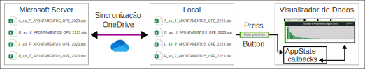

# 📈⏰ Working Hours Dashboard 📊
[](https://docs.python.org/3.9/)
[](https://www.esri.com/pt-br/arcgis/products/arcgis-pro/overview)
[](https://pro.arcgis.com/en/pro-app/latest/arcpy/main/arcgis-pro-arcpy-reference.htm)


This project generates dynamic analytical graphs for enterprise management using Python's Dash library. It requires Excels worksheets to be available locally. They must have the following columns.

|employee|date|project|product|task|total hours|
|---|---|---|---|---|---|
|John|23/07/24|project1|product1.1|backend development|7.4

> Names inside the repository might be in Portuguese because I developed in a way to be easily plugable to the Codex workhours worksheets back in the day.

## ⬇️ How to install
### Set the directory of the worksheets
The company's workhours worksheets must be locally available, as by using OneDrive-Desktop to add their **cloud directory** as a shortcut at your local. Copy the local path to this mirrored local directory and paste it as the environment variable `COMPANY_WORKHOURS_EXCELS_DIR` in the `.env`.

### Install project using [Poetry](https://python-poetry.org/docs/)
```shell
# Change directory into project directory
cd <project-dir>

# Install venv
poetry install

# Activate venv
poetry shell

# Run project
python run.py
```

## 🛠️ How it works?
It is strongly dependent upon OneDrive's synchronization.  
<div style="display: flex; justify-content: center; align-items: center; height: fit-content;">
    
</div>

## 🌳 Repository Structure 🧬
<pre>.
├── <a href="/home/julianofinck/codex/tabela-apontamentos/project-time-tracker/README.md">📄 README.md</a>
├── <a href="/home/julianofinck/codex/tabela-apontamentos/project-time-tracker/app">📁 app</a>
│   ├── <a href="/home/julianofinck/codex/tabela-apontamentos/project-time-tracker/app/__init__.py">📄 __init__.py</a>
│   ├── <a href="/home/julianofinck/codex/tabela-apontamentos/project-time-tracker/app/alternative_to_onedrive.py">📄 alternative_to_onedrive.py</a>
│   ├── <a href="/home/julianofinck/codex/tabela-apontamentos/project-time-tracker/app/app_state.py">📄 app_state.py</a>
│   ├── <a href="/home/julianofinck/codex/tabela-apontamentos/project-time-tracker/app/assets">📁 assets</a>
│   │   ├── <a href="/home/julianofinck/codex/tabela-apontamentos/project-time-tracker/app/assets/css">📁 css</a>
│   │   │   ├── <a href="/home/julianofinck/codex/tabela-apontamentos/project-time-tracker/app/assets/css/card.css">📄 card.css</a>
│   │   │   ├── <a href="/home/julianofinck/codex/tabela-apontamentos/project-time-tracker/app/assets/css/header-selectors.css">📄 header-selectors.css</a>
│   │   │   ├── <a href="/home/julianofinck/codex/tabela-apontamentos/project-time-tracker/app/assets/css/main.css">📄 main.css</a>
│   │   │   ├── <a href="/home/julianofinck/codex/tabela-apontamentos/project-time-tracker/app/assets/css/root.css">📄 root.css</a>
│   │   │   ├── <a href="/home/julianofinck/codex/tabela-apontamentos/project-time-tracker/app/assets/css/tab.css">📄 tab.css</a>
│   │   │   └── <a href="/home/julianofinck/codex/tabela-apontamentos/project-time-tracker/app/assets/css/table.css">📄 table.css</a>
│   │   ├── <a href="/home/julianofinck/codex/tabela-apontamentos/project-time-tracker/app/assets/favicon.ico">📄 favicon.ico</a>
│   │   ├── <a href="/home/julianofinck/codex/tabela-apontamentos/project-time-tracker/app/assets/favicon_mock.ico">📄 favicon_mock.ico</a>
│   │   └── <a href="/home/julianofinck/codex/tabela-apontamentos/project-time-tracker/app/assets/script.js">📄 script.js</a>
│   ├── <a href="/home/julianofinck/codex/tabela-apontamentos/project-time-tracker/app/cache">📁 cache</a>
│   │   ├── <a href="/home/julianofinck/codex/tabela-apontamentos/project-time-tracker/app/cache/state.pickle">📄 state.pickle</a>
│   │   └── <a href="/home/julianofinck/codex/tabela-apontamentos/project-time-tracker/app/cache/valid_data.pickle">📄 valid_data.pickle</a>
│   ├── <a href="/home/julianofinck/codex/tabela-apontamentos/project-time-tracker/app/callbacks">📁 callbacks</a>
│   │   ├── <a href="/home/julianofinck/codex/tabela-apontamentos/project-time-tracker/app/callbacks/__init__.py">📄 __init__.py</a>
│   │   ├── <a href="/home/julianofinck/codex/tabela-apontamentos/project-time-tracker/app/callbacks/cards">📁 cards</a>
│   │   │   ├── <a href="/home/julianofinck/codex/tabela-apontamentos/project-time-tracker/app/callbacks/cards/__init__.py">📄 __init__.py</a>
│   │   │   ├── <a href="/home/julianofinck/codex/tabela-apontamentos/project-time-tracker/app/callbacks/cards/invalid_registers.py">📄 invalid_registers.py</a>
│   │   │   ├── <a href="/home/julianofinck/codex/tabela-apontamentos/project-time-tracker/app/callbacks/cards/team_commitment.py">📄 team_commitment.py</a>
│   │   │   └── <a href="/home/julianofinck/codex/tabela-apontamentos/project-time-tracker/app/callbacks/cards/valid_registers.py">📄 valid_registers.py</a>
│   │   ├── <a href="/home/julianofinck/codex/tabela-apontamentos/project-time-tracker/app/callbacks/headers.py">📄 headers.py</a>
│   │   └── <a href="/home/julianofinck/codex/tabela-apontamentos/project-time-tracker/app/callbacks/read_excels_bar.py">📄 read_excels_bar.py</a>
│   ├── <a href="/home/julianofinck/codex/tabela-apontamentos/project-time-tracker/app/commitment_card_processor.py">📄 commitment_card_processor.py</a>
│   ├── <a href="/home/julianofinck/codex/tabela-apontamentos/project-time-tracker/app/languages">📁 languages</a>
│   │   ├── <a href="/home/julianofinck/codex/tabela-apontamentos/project-time-tracker/app/languages/__init__.py">📄 __init__.py</a>
│   │   ├── <a href="/home/julianofinck/codex/tabela-apontamentos/project-time-tracker/app/languages/translations.csv">📄 translations.csv</a>
│   │   └── <a href="/home/julianofinck/codex/tabela-apontamentos/project-time-tracker/app/languages/translator.py">📄 translator.py</a>
│   ├── <a href="/home/julianofinck/codex/tabela-apontamentos/project-time-tracker/app/layout">📁 layout</a>
│   │   ├── <a href="/home/julianofinck/codex/tabela-apontamentos/project-time-tracker/app/layout/__init__.py">📄 __init__.py</a>
│   │   └── <a href="/home/julianofinck/codex/tabela-apontamentos/project-time-tracker/app/layout/layout.py">📄 layout.py</a>
│   ├── <a href="/home/julianofinck/codex/tabela-apontamentos/project-time-tracker/app/mocks">📁 mocks</a>
│   │   └── <a href="/home/julianofinck/codex/tabela-apontamentos/project-time-tracker/app/mocks/mock.py">📄 mock.py</a>
│   └── <a href="/home/julianofinck/codex/tabela-apontamentos/project-time-tracker/app/utils">📁 utils</a>
│       └── <a href="/home/julianofinck/codex/tabela-apontamentos/project-time-tracker/app/utils/logger.py">📄 logger.py</a>
├── <a href="/home/julianofinck/codex/tabela-apontamentos/project-time-tracker/img">📁 img</a>
│   └── <a href="/home/julianofinck/codex/tabela-apontamentos/project-time-tracker/img/flowchart.svg">📄 flowchart.svg</a>
├── <a href="/home/julianofinck/codex/tabela-apontamentos/project-time-tracker/logs">📁 logs</a>
│   └── <a href="/home/julianofinck/codex/tabela-apontamentos/project-time-tracker/logs/main.log">📄 main.log</a>
├── <a href="/home/julianofinck/codex/tabela-apontamentos/project-time-tracker/poetry.lock">📄 poetry.lock</a>
├── <a href="/home/julianofinck/codex/tabela-apontamentos/project-time-tracker/pyproject.toml">📄 pyproject.toml</a>
└── <a href="/home/julianofinck/codex/tabela-apontamentos/project-time-tracker/run.py">📄 run.py</a>

</pre>